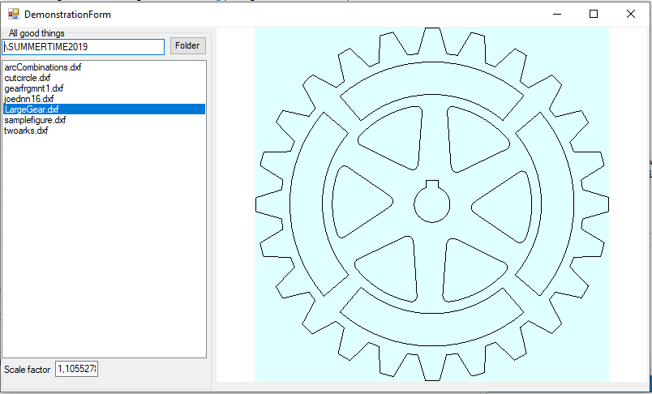

### DXFRender

Program for rendering dxf files. Uses IXMILIA dxf library for parsing dxf files.
There is a control for displaying parsed dxf files.



----

In case if you need to know the dimensions of DXF figure as obtained from drawing (I mean, a rectangular bound box containing all figures), you can refer to UserControlForPaint.cs; there is a field `completeDxfStruct savedStructureOfDxf`. It has method GetBoundingBox. Its fields contains relevant information. 

Alternatively (which is better), you can add a lines to `ListBoxDxfFiles_SelectedValueChanged`, where loading is done in Form1.cs. 
```
        private void ListBoxDxfFiles_SelectedValueChanged(object sender, EventArgs e) {
            DXFRendering.LOGICAL.singleDXFListBoxItem value = (DXFRendering.LOGICAL.singleDXFListBoxItem)this.listBoxDxfFiles.SelectedItem;
            //retrieve the logical structure of dxf file
            DXFRendering.LOGICAL.completeDxfStruct obtainedStruct = DXFRendering.LOGICAL.DxfReadWrapper.processDxfFile(value.fullPath);
            //============================= getting width and height =============================
            MyDxfBoundingBox dimensionBox = obtainedStruct.GetBoundingBox();
            double dimensionX = Math.Abs( dimensionBox.XLowerLeft-dimensionBox.XUpperRight );
            double dimensionY = Math.Abs( dimensionBox.YLowerLeft-dimensionBox.YUpperRight );
            MessageBox.Show("Width: "+dimensionX.toString()+"\n"+"Height: "+dimensionY.toString());
            //====================================================================================
            //transform it to initial graphical structure used during rendering
            this.userControlForPaint1.VerticalScroll.Value = 0;
            this.userControlForPaint1.HorizontalScroll.Value = 0;
            this.userControlForPaint1.setupLogicalAndGraphicalDXFstructures(obtainedStruct);
            this.userControlForPaint1.prepareActualGraphicalDXFStructure();
            //invoke transformations on graphical structure (later, when needed)
            // MEOW!
            //redraw? 
            this.userControlForPaint1.Refresh();
            
            //crutch to position drawing thing properly
            //this.userControlForPaint1.UserControlForPaint_Resize(null, null);
            //crutch to remove stray scrollbars
            this.userControlForPaint1.PerformLayout();
        }
 ```
